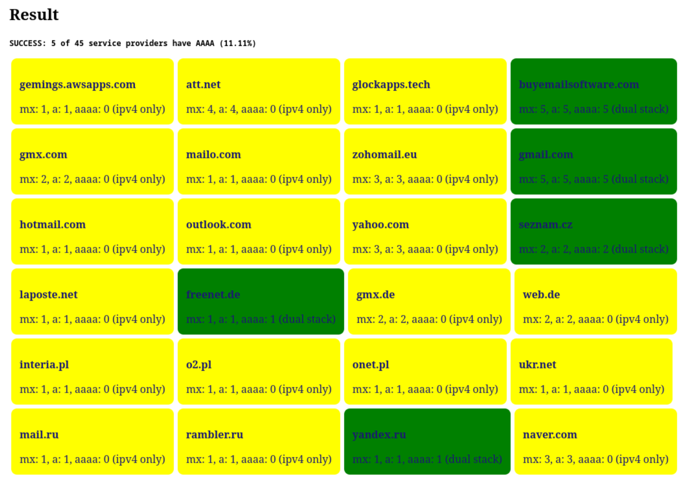

# Resolve AAAA MX of popular email service providers
See how many email providers support IPv6 MX servers. DNS query is done entirely
on the browser. No server involved(except for the public DNS APIs).

https://dxdxdt.github.io/ipv6/mx-aaaa

Made to track progress of major service providers' transition to IPv6.
